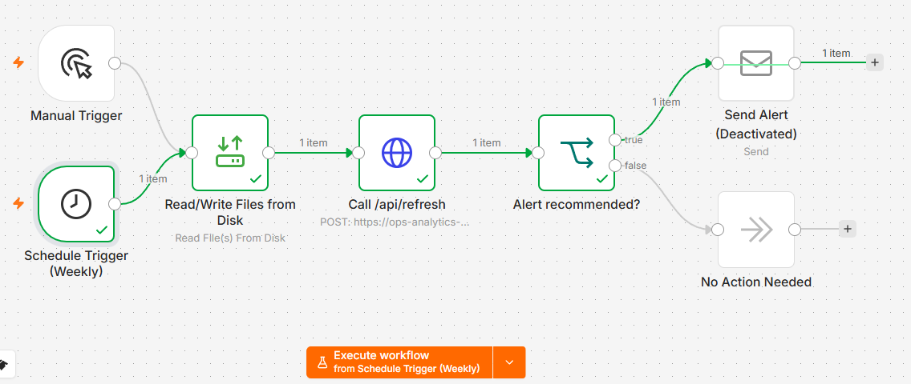
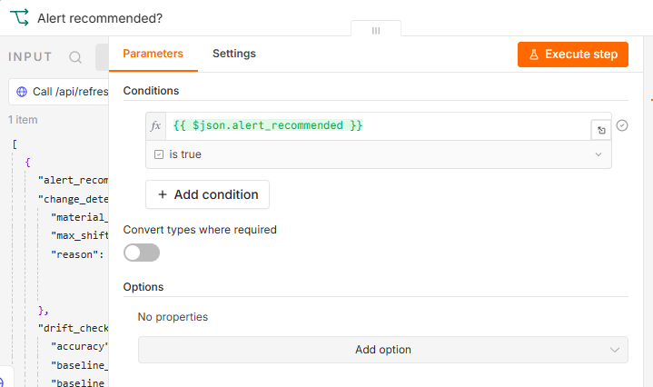

# Predictive Operations Analytics Pipeline
### Statistical Insight Engine · Delay-Risk Model · Objective-Ranked Recommendations

**Live Demo →** [leothegreatchan.github.io/ops-analytics-pipeline](https://leothegreatchan.github.io/ops-analytics-pipeline/)  
**Source Code →** [github.com/LeoTheGreatChan/ops-analytics-pipeline](https://github.com/LeoTheGreatChan/ops-analytics-pipeline)

---

## The Problem

Most operational dashboards stop at description: here is what happened. They rarely tell an operations team which finding matters most, what to do about it, or how the recommendation changes depending on whether the business is optimising for customer experience or cost control this quarter.

This project builds the layer above the dashboard: a pipeline that turns raw delivery data into ranked, numeric, business-objective-aware recommendations, with the reasoning behind each one traceable back to a real statistic.

---

## Data

**Source:** [Amazon Delivery Dataset](https://www.kaggle.com/datasets/sujalsuthar/amazon-delivery-dataset) (Kaggle), a real-world last-mile delivery dataset, 43,739 rows covering Feb–Apr 2022.

**This is a static, historical dataset, not a live feed.** Every claim in this project is framed accordingly: "built on a real-world delivery dataset," not "live monitoring." The distinction matters and is kept precise throughout the dashboard, the code comments, and this README.

**Columns:** Order_ID, Agent_Age, Agent_Rating, Store/Drop Latitude & Longitude, Order_Date, Order_Time, Pickup_Time, Weather, Traffic, Vehicle, Area, Delivery_Time, Category.

---

## Data Quality & Validation

This section exists because catching problems in the data is as much a part of the analysis as the findings themselves, and it's worth showing the working, not just the conclusions.

**Cleaning:** 43,739 raw rows → 43,594 after dropping 145 rows (0.3%) with nulls in Weather, Traffic, or Agent_Rating. 3,485 rows (8.0%) had unusable geocodes (near 0,0, clearly invalid for an India-based dataset) and were excluded from distance-dependent calculations specifically, while still contributing to every other statistic.

**Confounded variable caught and removed:** an early pass flagged "Morning deliveries" as showing a dramatic 93% lower breach rate. Investigation showed this wasn't an independent finding: 100% of Morning-band orders in this dataset also carry `Traffic = Low`, a structural artifact of the source data, not a discovered pattern. Reporting both would have double-counted the same underlying signal. Time_Band was excluded as a standalone insight dimension as a result, kept for descriptive display only.

**An assumption corrected against the real data:** external analysis of this dataset is sometimes cited as showing no meaningful relationship between agent rating and delivery performance. The actual correlation in this dataset is -0.31, and the breach rate drops from 76.9% for agents rated below 3.0 to roughly 14-16% for agents rated 4.5 and above, a real, verified, and substantial effect once checked directly rather than taken on secondary authority. It became the model's top-ranked feature.

**Holiday sample size:** only two public holidays fall within the dataset's 8-week window (Maha Shivaratri, Holi), landing on only two of seven weekdays. The holiday effect (23.7% vs 22.9% breach rate) is reported as directional, not statistically robust, rather than dressed up as a confident finding the sample can't support.

---

## Pipeline Architecture

**① Feature engineering** — `Distance_km` (haversine from store/drop coordinates, nulled for bad geocodes), `Weekday`, `Is_Weekend`, `Is_Holiday` (India public holiday calendar), `Order_Hour` bucketed into time-of-day bands, `SLA_Breach` flag (relative threshold: 75th percentile of delivery time, computed per Area rather than a fixed arbitrary cutoff).

**② Statistical insight engine** — scans single and compound segments (Area, Weather, Traffic, Vehicle, Weekday, Area×Traffic, Weather×Traffic, Agent Rating bands), filters to segments with a minimum sample size (200 rows) and a meaningful effect size (±15% breach-rate lift vs baseline), and computes a numeric buffer suggestion per segment from the actual 90th-percentile-vs-median delivery time gap, not an invented number.

**③ Predictive model** — Random Forest classifier predicting delay risk per delivery. 85.9% accuracy, 0.74 F1 on the breach class (87% recall, 64% precision — deliberately tuned via `class_weight='balanced'` to catch real breaches over minimising false alarms, since missing a genuine SLA breach is operationally costlier than over-flagging one). Feature importances cross-validated against the statistical layer for consistency (both independently found the holiday effect negligible, for example).

**④ Business-value ranking** — every candidate finding is scored against two weighted objectives, Customer Satisfaction (severity-weighted) and Cost Reduction (volume-weighted), producing genuinely different top-ranked recommendations, not a cosmetic reorder. For example: Customer Satisfaction ranks a severe but lower-volume weather×traffic combination first; Cost Reduction ranks a modest-severity but very high-volume vehicle category first, because its cumulative cost exposure is larger.

**⑤ Insight write-up** — the ranked statistical findings are converted into plain-English, numbered recommendations with bolded figures (e.g. "Fog weather combined with Jam traffic shows a **174% higher** breach rate than average... Add a **31% buffer**"), an LLM writing layer on top of a stats/ML layer, kept explicitly distinct rather than blurred into a single "AI insight" claim.

**⑥ Dashboard** — four-tab interface (Overview, Segments, Insights & Recommendations, Risk Forecast), with an objective toggle that live-reorders the recommendation list, and a colour system (green = beneficial, black = neutral, red = risk) applied consistently across KPI values, charts, and table cells.

---

**n8n refresh workflow:**



Two trigger nodes (Manual, for on-demand runs, and Schedule, weekly) both feed the same downstream chain, one refresh logic path to maintain, not two.



The "Alert recommended?" node branches on `{{ $json.alert_recommended }}`, a real field from the API response reflecting either material change or model drift, not a placeholder condition.

---

## Phase 2: Automated Refresh Pipeline

The pipeline above runs once against a static file. Phase 2 makes it re-runnable against new data of the same structure, without re-doing the design decisions each time.

**Trigger:** n8n workflow (`n8n_workflow.json`) with two trigger nodes, Manual (on-demand) and Schedule (weekly), both feeding the same downstream chain, so there is one refresh logic path to maintain, not two.

**Orchestration (`api/app.py`, `/api/refresh`):**
1. Clean the new CSV (`feature_engineering.py`)
2. **Validate, don't retrain** — the existing model is checked against the new batch's real outcomes (`drift_check.py`), producing genuine accuracy/F1 numbers, not an estimate. Retraining is flagged as a recommendation for human review, not triggered automatically; a single new batch retraining a tree ensemble each run risks instability that a deliberate, reviewed retrain avoids.
3. Re-scan segments (`insight_engine.py`) and re-rank both objectives
4. **Check for material change** (`change_detection.py`) — compares the new findings against a saved snapshot of the prior run. Material change is defined as either a >5 percentage-point shift in any segment's breach-rate lift, or a change in which segment ranks #1 under either objective.
5. **Conditional LLM write-up** — the insight text is only regenerated (real Claude API call, `llm_insight_writer.py`) when step 4 detects material change. Verified in testing: an identical re-run correctly produces a 0.0pp shift and skips the LLM call entirely, so a stable operation costs nothing on most refreshes, this is the mechanism, not just an intention.
6. n8n reads the response's `alert_recommended` flag (true if either material change or model drift was detected) and routes to an email/Slack alert or does nothing, same compound-condition IF-node pattern as the sentiment pipeline's triage logic.

**Why the LLM call is now real, not templated:** an earlier draft of this project used a Python template function to generate insight text, close enough to an LLM's output that it initially got described as one in this README. That was a real discrepancy against the project's own accuracy standard, caught and corrected: `llm_insight_writer.py` now calls the Claude API directly (Claude Haiku, a short templated completion doesn't need a larger model). A template fallback still exists for cost-free local development when no API key is set, printing an explicit warning so it's never silently mistaken for the real thing.

**Persisting across Render's ephemeral filesystem.** Render's free tier boots a fresh container on every cold start, discarding anything written to disk at runtime. In testing, this meant the change-detection snapshot and the refreshed data files were silently lost between refreshes, every cold-started run looked like a "first run," regardless of what had actually happened before. The fix: `scripts/github_commit.py` pushes the six updated data files straight back to GitHub via the Contents API, but only when a refresh finds a material change, not on every run. Since Render auto-deploys on every push to `main`, the next cold start boots from a container that already has this data baked in, git itself becomes the durable store, with no separate database or persistence layer needed. Verified in production: a refresh correctly committed (`github_commit: "committed"`) and triggered a real Render redeploy on its own, and a repeat refresh against unchanged data correctly stayed silent (`github_commit: "skipped (no material change)"`), confirming the gate discriminates genuinely new findings from repeated ones, not just in a single session but across an actual deploy cycle.

---

## What's ML, What's Statistics, and What's an LLM Writing It Up

Being precise about this distinction is itself part of the deliverable:

| Component | Technique | Type |
|---|---|---|
| Delay-risk classifier | Random Forest | Supervised ML |
| Numeric buffer suggestions | Percentile/quantile statistics | Statistics, not ML |
| Segment findings | Grouped comparison + effect-size filtering | Statistics, not ML |
| Objective-based ranking | Weighted scoring function | Business logic, not ML |
| Plain-English write-up | LLM call | AI, explicitly a writing layer, not a decision-maker |

---

## Tech Stack

| Layer | Technology |
|---|---|
| Data processing | Python, Pandas, NumPy |
| Modelling | scikit-learn (Random Forest) |
| Statistics | SciPy, Pandas |
| Insight generation | Claude API (Haiku), called conditionally, not per request |
| Refresh orchestration | n8n (dual trigger: Manual + Schedule), Flask |
| API | Flask, Flask-CORS |
| Frontend | HTML, CSS, Chart.js |
| Hosting | GitHub Pages (frontend) + Render (API) |

---

## Key Design Decisions

**Why precompute instead of computing live per request?** The underlying dataset never changes. Recomputing statistics, retraining the model, or calling an LLM on every page visit would be slower, costlier, and would misrepresent the project as live analysis when it isn't. Everything is computed once in a batch step and served as static JSON; the only runtime work is filtering and re-sorting already-computed data, which is why the objective toggle feels instant.

**Why a relative SLA threshold instead of a fixed one?** The dataset has no pre-labelled "late" flag. A fixed threshold (e.g. "over 150 minutes is late") would be an arbitrary number invented for this project. A relative threshold, the 75th percentile of delivery time within each area, is data-derived and defensible under questioning.

**Why keep n8n out of the core statistical/ML pipeline, but use it for refresh orchestration?** The actual analytical value of this project, statistical rigour, model validation, business-aware ranking, lives entirely in the Python layer, not in n8n. That distinction matters for positioning against the author's separate [sentiment analysis pipeline](https://github.com/LeoTheGreatChan/saas-sentiment-analyzer), which is genuinely n8n-centric. In Phase 2, n8n's role stays narrow and correct to what orchestration tools are for: triggering a refresh and routing an alert, never touching the statistics, model, or write-up logic itself.

---

## Reproducing This Pipeline

1. Download the dataset (see `data/raw/README.md`) and place `amazon_delivery.csv` in `data/raw/`
2. `pip install -r requirements.txt`
3. Run scripts in order from the repo root:
   ```
   python scripts/feature_engineering.py
   python scripts/insight_engine.py
   python scripts/model.py
   python scripts/build_insights.py
   python scripts/build_remaining_data.py
   ```
4. Outputs land in `data/processed/` as five JSON files, currently embedded directly into `frontend/index.html`; Phase 2 will serve these live via the Flask API instead

---

## Extension Opportunities

- **Second dataset partner** — extending the pipeline to a multi-carrier delivery dataset to test whether findings generalise
- **Time-series forecasting** — a proper Prophet or seasonal-decomposition model for the Risk Forecast tab, beyond the current pattern-based aggregation
- **Automated retraining pipeline** — currently retraining is a flagged, human-reviewed decision (see Phase 2); a supervised auto-retrain path could be added once enough refresh history exists to trust it
- **Real-time alert delivery** — the n8n workflow's Send Alert node is built but not yet wired to live email/Slack credentials

---

*Built by Leo Chan · July 2026*